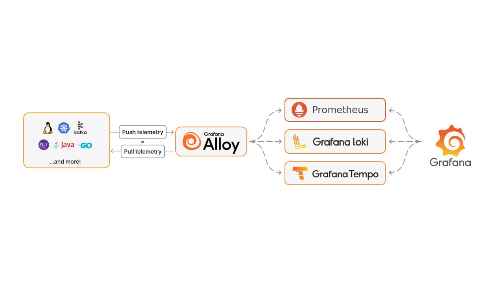

# k8s-grafana-stack

Helm umbrella chart for a complete Kubernetes observability stack: metrics, logs and traces, collected by Alloy and visualized in Grafana.

---

## Install

### Any Kubernetes distribution

No configuration needed. The chart works out of the box with sensible defaults:
- Alloy scrapes cluster metrics and pod logs automatically
- Prometheus, Loki and Tempo are pre-configured as Grafana datasources
- Kubernetes dashboards are pre-installed in Grafana
- Grafana is accessible via `kubectl port-forward`

It is recommended to install the chart in a dedicated `monitoring` namespace.

The chart is distributed as an OCI artifact via GitHub Container Registry — no `helm repo add` needed.

**1. Install the chart:**

```bash
helm install k8s-grafana-stack oci://ghcr.io/romain-malfroid/helm-charts/k8s-grafana-stack \
  -n monitoring --create-namespace
```

Pin a specific version with `--version 0.2.12`.

Access Grafana at http://localhost:3000 (admin / admin):

```bash
kubectl port-forward svc/k8s-grafana-stack-grafana 3000:80 -n monitoring
```

### With ingress

To expose Grafana via your ingress controller, add the following to a `values.yaml`. A commented example is available in [`charts/k8s-grafana-stack/values.yaml`](charts/k8s-grafana-stack/values.yaml).

This approach works with any ingress controller (nginx, Traefik, etc.) including those that also implement the Gateway API — modern controllers like Traefik v3 support both APIs simultaneously.

```yaml
grafana:
  ingress:
    enabled: true
    ingressClassName: nginx     # or traefik, or any other ingress controller
    hosts:
      - your-domain
    path: /grafana
  grafana.ini:
    server:
      root_url: "http://your-domain/grafana"
      serve_from_sub_path: true
```

```bash
helm install k8s-grafana-stack oci://ghcr.io/romain-malfroid/helm-charts/k8s-grafana-stack \
  -f values.yaml -n monitoring --create-namespace
```

### k3s

k3s requires two additional lines in your `values.yaml`. These are already commented in [`charts/k8s-grafana-stack/values.yaml`](charts/k8s-grafana-stack/values.yaml), just uncomment them:

```yaml
prometheus-node-exporter:
  hostNetwork: false
  hostPID: false
```

> This disables host network and PID namespace sharing on node-exporter to avoid port conflicts with k3s internal processes. A small number of low-level host metrics will be unavailable, but this is the recommended approach for k3s and the chart remains fully functional.

### Upgrade

```bash
helm upgrade k8s-grafana-stack oci://ghcr.io/romain-malfroid/helm-charts/k8s-grafana-stack \
  [-f values.yaml] -n monitoring
```

## Architecture



## Configuration

### Enable / disable components

By default all components are enabled. Set `enabled: false` to disable a component — this removes both the storage layer and the corresponding Alloy collection pipeline:

```yaml
prometheus:
  enabled: false  # disables metrics (Prometheus, node-exporter, kube-state-metrics, Alertmanager)

loki:
  enabled: false  # disables log storage and collection

tempo:
  enabled: false  # disables trace storage and collection
```

Common combinations:

| Use case | Config |
|----------|--------|
| Full stack (default) | all enabled |
| Metrics only | `loki.enabled: false` + `tempo.enabled: false` |
| Metrics + logs | `tempo.enabled: false` |
| Logs only | `prometheus.enabled: false` + `tempo.enabled: false` |

### Common overrides

| Key | Description | Default |
|-----|-------------|---------|
| `clusterName` | Cluster name shown in dashboards | `"local"` |
| `grafana.adminPassword` | Grafana admin password | `admin` |
| `prometheus.server.retention` | Metrics retention period | `7d` |
| `tempo.tempo.retention` | Traces retention period | `24h` |

### Scrape your app metrics

If your application exposes a `/metrics` endpoint (Prometheus format), add these annotations to your pod template and Alloy will scrape it automatically — no extra configuration needed:

```yaml
# In your Deployment / StatefulSet, under spec.template.metadata
metadata:
  annotations:
    prometheus.io/scrape: "true"
    prometheus.io/port: "8080"     # port your app exposes metrics on
    prometheus.io/path: "/metrics" # optional, defaults to /metrics
```

### Kubernetes naming conventions for scraping

For scraping to work properly and ensure consistency across metrics, logs and traces, your applications **must follow the official Kubernetes labeling conventions (in English)**.

| Label                          | Example              | Description              |
|--------------------------------|----------------------|--------------------------|
| `app.kubernetes.io/name`       | `api-gateway`        | Application name         |
| `app.kubernetes.io/instance`   | `api-gateway-prod`   | Unique instance          |
| `app.kubernetes.io/version`    | `1.2.3`              | Version                  |
| `app.kubernetes.io/component`  | `backend`            | Component role           |
| `app.kubernetes.io/part-of`    | `my-app`             | Parent application       |
| `app.kubernetes.io/managed-by` | `helm`               | Management tool          |

These labels are used by the observability stack to:
- properly identify applications
- group metrics, logs and traces
- improve dashboards and filtering in Grafana

> ⚠️ Non-standard or inconsistent labels may result in incomplete or poorly grouped data.

### Advanced Alloy configuration

Alloy uses its own configuration language (River) to define pipelines. Two extension points are available without touching the chart internals:

**`extraAlloyConfig`** — appends raw Alloy config blocks at the end of the generated config. Use this to add a custom scrape job for an endpoint not covered by the annotation-based discovery:

```yaml
extraAlloyConfig: |
  prometheus.scrape "my_app" {
    targets = [{ __address__ = "my-service.default.svc:9090" }]
    forward_to = [prometheus.remote_write.default.receiver]
  }
```

**`logsProcessStages`** — injects pipeline stages between log collection and Loki. Use this to parse and label your logs without creating a separate log source:

```yaml
logsProcessStages: |
  stage.regex {
    expression = `(?i)\b(?P<level>TRACE|DEBUG|INFO|WARN|ERROR|FATAL)(?:ING)?\b`
  }
  stage.labels {
    values = { level = "level" }
  }
```

See the [Alloy documentation](https://grafana.com/docs/alloy/latest/reference/components/) for all available components.

---

## Stack

| Component | Chart | Version | Role |
|-----------|-------|---------|------|
| **Alloy** | `grafana/alloy` | 1.6.2 | Collector |
| **kube-state-metrics** | `prometheus-community/kube-state-metrics` | 7.2.1 | Kubernetes object metrics |
| **node-exporter** | `prometheus-community/prometheus-node-exporter` | 4.52.1 | Node-level metrics |
| **Prometheus** | `prometheus-community/prometheus` | 28.13.0 | Metrics storage |
| **Alertmanager** | `prometheus-community/alertmanager` | 1.33.1 | Alerting |
| **Loki** | `grafana/loki` | 6.55.0 | Log storage |
| **Tempo** | `grafana/tempo` | 1.24.4 | Trace storage |
| **Grafana** | `grafana/grafana` | 10.5.15 | Visualization |

> **Metrics only:** If you only need metrics + Grafana (no logs, no traces), use [`kube-prometheus-stack`](https://github.com/prometheus-community/helm-charts/tree/main/charts/kube-prometheus-stack) instead. It bundles Prometheus Operator, Grafana, node-exporter and kube-state-metrics in a single chart.
>
> **Cloud / Grafana Cloud:** If you run on a managed Kubernetes (EKS, GKE, AKS) and want to send telemetry to Grafana Cloud instead of self-hosting the storage, use [`k8s-monitoring`](https://github.com/grafana/k8s-monitoring-helm) — Grafana's official chart for that use case. This chart is the right choice when you self-host the full MELT stack on-prem or on a bare cluster.

---

## Dashboards

The following dashboards are **automatically installed** at startup — nothing to do:

| Dashboard | Grafana.com ID |
|-----------|---------------|
| Kubernetes / Views / Global | [15757](https://grafana.com/grafana/dashboards/15757) |
| Kubernetes / Views / Namespaces | [15758](https://grafana.com/grafana/dashboards/15758) |
| Kubernetes / Views / Nodes | [15759](https://grafana.com/grafana/dashboards/15759) |
| Kubernetes / Views / Pods | [15760](https://grafana.com/grafana/dashboards/15760) |

To disable a dashboard, set it to `null` in your `values.yaml`:

```yaml
grafana:
  dashboards:
    kubernetes:
      k8s-views-nodes: null
```

